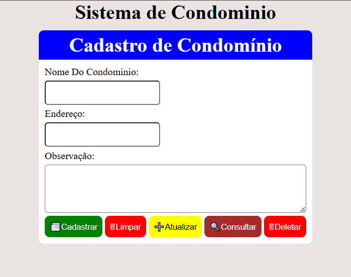

1. 🧩 O problema que o projeto resolve (e por que é importante)
Durante a rotina de trabalho em gestão condominial, surgiu um obstáculo recorrente: a perda de informações importantes ao longo do tempo.

Meu supervisor constantemente se via buscando anotações antigas ou tentando lembrar de ocorrências passadas em condomínios — o que gerava retrabalho, falhas de comunicação e perda de eficiência.

Não havia um sistema leve e acessível para manter um histórico centralizado e fácil de consultar.

Esse projeto nasceu para resolver exatamente isso.

2. 🛠️ A solução proposta
Criei um sistema de gestão de condomínios 100% em JavaScript puro, que roda diretamente no navegador e armazena dados localmente, sem necessidade de servidores ou infraestrutura adicional.

Funcionalidades principais:
✅ Cadastro de novos condomínios

Nome, endereço, responsável e contato, tudo salvo localmente.

📝 Registro de observações e ocorrências

Cada condomínio pode ter um histórico próprio, criando uma linha do tempo de eventos.

🔍 Consulta rápida e eficiente

Localize informações em segundos, com uma interface clara e sem distrações.

🧭 Leve, intuitivo e direto ao ponto

Foco na simplicidade para uso até por usuários não técnicos.

📸 Screenshots / Demonstração:

3. ⚔️ Desafios enfrentados e como foram superados
Persistência de dados sem backend
Solução: uso estratégico do localStorage para manter dados acessíveis e seguros no próprio navegador.

Interface para usuários não técnicos
Solução: foco em UX simples, com campos claros e navegação direta.

Organização do histórico de cada condomínio
Solução: estrutura em linha do tempo, com associação direta entre condomínio e suas ocorrências.

4. ⚙️ Decisões técnicas e seus trade-offs
JavaScript puro ao invés de frameworks (como React/Vue)
✅ Mais leve, mais rápido, sem build ou dependências
❌ Menos modular, mas ideal para um projeto com escopo controlado

localStorage como banco de dados
✅ Simples, offline, zero configuração
❌ Limitado em tamanho e acesso multiusuário (mas atende ao uso individual/local)

HTML/CSS puro
✅ Controle total e aprendizado profundo dos fundamentos
❌ Mais trabalho para responsividade e manutenção em larga escala

5. 📚 Aprendizados e próximos passos
💡 O que aprendi:
Como transformar uma dor real do dia a dia em um projeto útil

A importância da clareza na experiência do usuário (UX)

Fundamentos de persistência de dados no navegador com localStorage

🛠️ Próximos passos:
Adicionar autenticação simples para múltiplos usuários

Exportação dos dados para PDF ou Excel

Versão mobile com melhorias de responsividade

Sincronização com backend para persistência em nuvem
